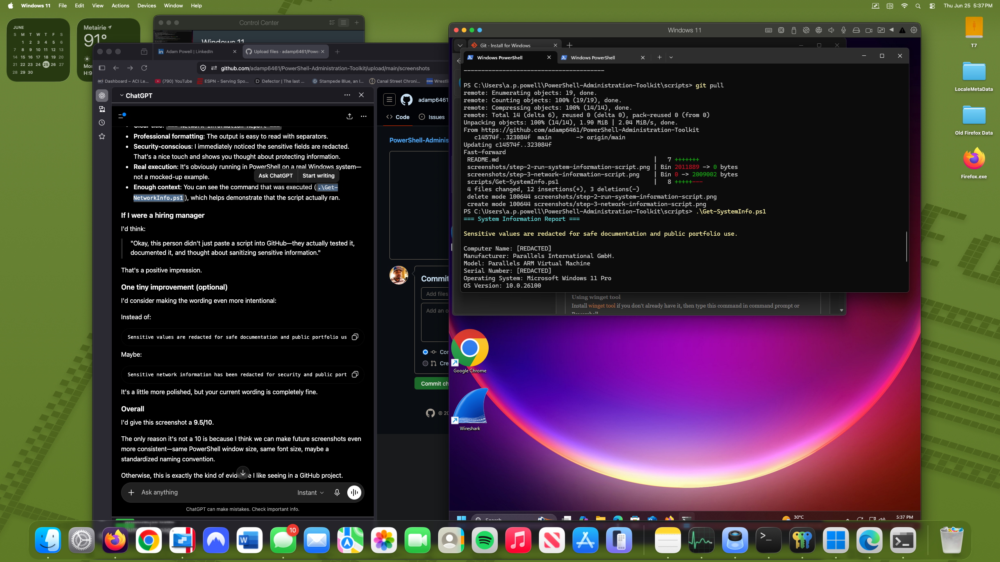
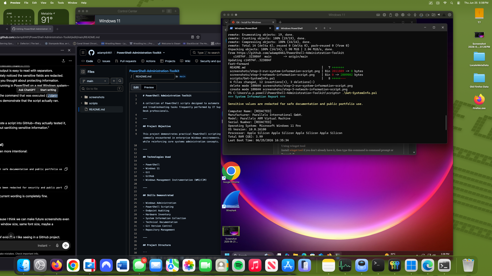

# PowerShell Administration Toolkit

A collection of PowerShell scripts designed to automate common Windows administration, endpoint auditing, and troubleshooting tasks frequently performed by IT Support Engineers, Systems Administrators, and Help Desk professionals.

---

## Project Objective

This project demonstrates practical PowerShell scripting skills by automating routine administrative tasks commonly encountered in enterprise Windows environments. Each script is designed to improve efficiency while reinforcing core systems administration concepts.

---

## Technologies Used

- PowerShell
- Windows 11
- Git
- GitHub
- Windows Management Instrumentation (WMI/CIM)

---

## Skills Demonstrated

- Windows Administration
- PowerShell Scripting
- Endpoint Auditing
- Hardware Inventory
- System Information Collection
- Technical Documentation
- Git Version Control
- Repository Management

---

## Project Structure

```
PowerShell-Administration-Toolkit
│
├── README.md
├── LICENSE
├── scripts
│   └── Get-SystemInfo.ps1
│
└── screenshots
    ├── step-1-clone-repository.png
    └── step-2-run-system-information-script.png
```

---

# Current Scripts

## Get-SystemInfo.ps1

Collects important Windows endpoint information including:

- Computer Name
- Manufacturer
- Model
- Serial Number
- Operating System
- Windows Version
- Processor
- Installed Memory (RAM)
- Last Boot Time

This information is useful for:

- Asset inventory
- Help Desk troubleshooting
- Endpoint documentation
- Hardware verification
- System audits

---

# Screenshots

## Step 1 – Clone Repository


The project repository is cloned locally using Git, demonstrating version control and repository management.

---

## Step 2 – Execute System Information Script



The PowerShell script successfully collects and displays system information from a Windows endpoint.

---


## Step 3 – Execute Network Information Script




Executed the PowerShell network auditing script. Sensitive information is automatically redacted, demonstrating security-conscious documentation practices suitable for public repositories.
# Future Enhancements

Future scripts planned for this toolkit include:

- Local User Audit
- Installed Software Inventory
- Running Services Report
- Windows Event Log Export
- Failed Logon Audit
- Disk Health Report
- Password Policy Audit
- Complete HTML System Report

---

# Author

**Adam Powell**

- CompTIA Security+
- Jamf Certified Associate (Jamf 100)
- Apple Genius
- IT Support | Systems Administration | Cybersecurity

GitHub:
https://github.com/adamp6461
